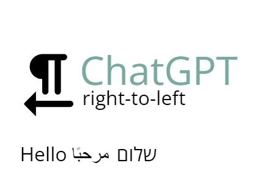
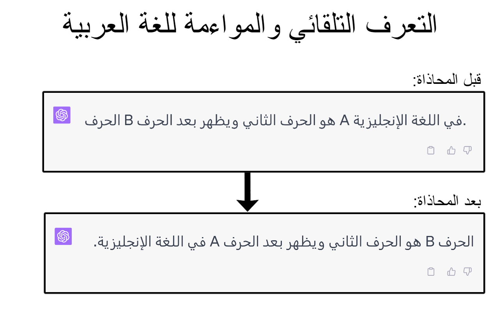
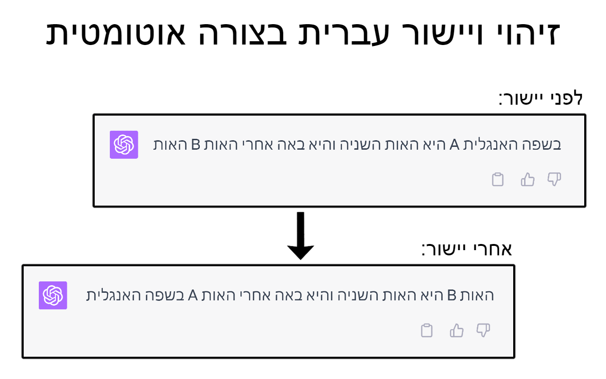

[](https://github.com/gilhanan/chat-gpt-rtl/actions/workflows/ci.yml)
[](https://github.com/gilhanan/chat-gpt-rtl/actions/workflows/codeql.yml)
[](https://ghchatgptrtl.blob.core.windows.net/main/extension.zip)
[](https://ghchatgptrtl.blob.core.windows.net/main/coverage/lcov-report/index.html)
[](https://ghchatgptrtl.blob.core.windows.net/main/playwright-report/index.html)

# ChatGPT RTL Chrome Extension

This is a Chrome extension designed to enhance the usability of ChatGPT for users who communicate using right-to-left (RTL) scripts. The extension automatically detects RTL characters and adjusts the direction of the DOM elements accordingly, providing a seamless and intuitive interface for RTL languages. Ideal for users who interact with languages like Arabic, Hebrew, Persian, Urdu, and others that require RTL orientation.



## Screenshots

<details>
<summary> <strong>Expand</strong> </summary>

### Arabic



### Hebrew



</details>

## How to install

You can install it from [Chrome Web Store](https://chrome.google.com/webstore/detail/chatgpt-rtl/nabcbpmmefiigmjpopfciegmlgihkofd) or [Microsoft Edge Add-ons](https://microsoftedge.microsoft.com/addons/detail/chatgpt-rtl/nanhglhndgcjhjcbfimjfopabdakdpmb)

## Getting Started

Clone the repository to your local machine:

```bash
git clone https://github.com/gilhanan/chat-gpt-rtl.git
cd chatgpt-rtl
```

Install the necessary dependencies:

```bash
npm install
```

## Building the Extension

Build the extension by running the following command:

```bash
npm run build
```

This command will generate a `dist` directory with the built extension and a `extension.zip` file that you can upload to the Chrome Web Store.

## Developing the Extension

Run the following command to run a build that will automatically reload the extension when you make changes:

```bash
npm run watch
```
